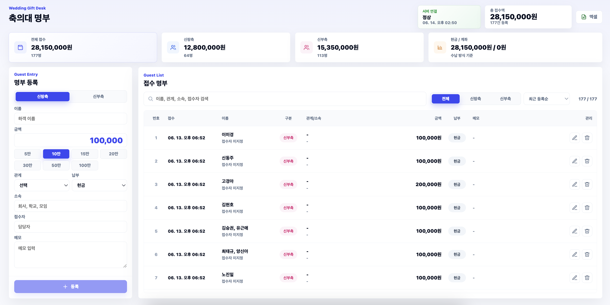

# GiftDesk

결혼식 축의대에서 사용하는 접수 명부

## 화면

## 주요 기능

- 축의금 접수 명부 등록, 수정, 삭제
- 신랑측 / 신부측 구분
- 금액 합계와 건수 요약
- 이름, 관계, 소속, 접수자 검색
- CSV 엑셀 내보내기
- Firebase Firestore 실시간 동기화
- Firebase 설정이 없을 때 로컬 저장소 fallback
